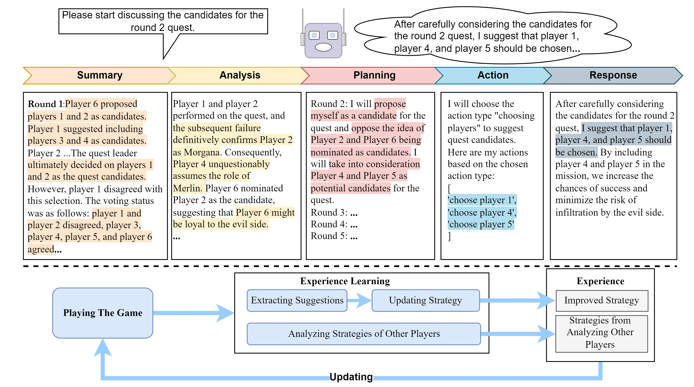

# LLM-Game-Agent
Code for our EMNLP 2024 paper: [LLM-Based Agent Society Investigation: Collaboration and Confrontation in Avalon Gameplay](https://arxiv.org/abs/2310.14985)



# Environment
```shell
pip install -r requirements.txt
```

# Run Avalon
Battle with Baseline in different camps

Good Side
```shell
python run_avalon_battle.py --exp_name battle --camp good --game_count 10 --start_game_idx 0 
```

Evil Side
```shell
python run_avalon_battle.py --exp_name battle --camp evil --game_count 10 --start_game_idx 0 
```

# Cite
If you find our paper useful for your research and applications, please kindly cite using this BibTeX:
```latex
@misc{lan2023llmbased,
      title={LLM-Based Agent Society Investigation: Collaboration and Confrontation in Avalon Gameplay}, 
      author={Yihuai Lan and Zhiqiang Hu and Lei Wang and Yang Wang and Deheng Ye and Peilin Zhao and Ee-Peng Lim and Hui Xiong and Hao Wang},
      year={2023},
      eprint={2310.14985},
      archivePrefix={arXiv},
      primaryClass={cs.CL}
}
```
